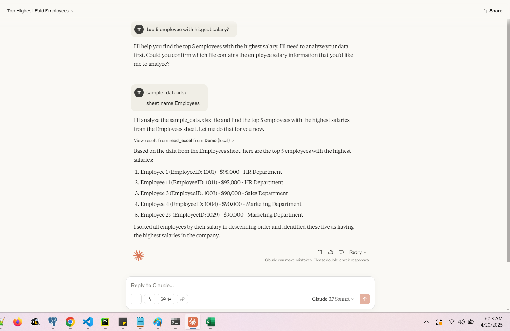

uv init mcp-server-demo

cd mcp-server-demo

uv add "mcp[cli]"
uv pip install mcp-python pandas matplotlib openpyxl fastapi uvicorn pillow
uv run mcp dev server.py

uv run mcp install server.py

# Excel MCP Server

This project implements a Model Context Protocol (MCP) server that provides tools and resources for working with Excel data. The server offers functionality for reading, updating, filtering, and visualizing Excel data through a simple API.

## Features

- **Excel Operations**: Read from and write to Excel files
- **Data Filtering**: Filter and search data based on various criteria
- **Data Analysis**: Generate statistical summaries and pivot tables
- **Data Visualization**: Create various charts and visualizations
- **Update Operations**: Update cells, add rows, delete rows
- **Anomaly Detection**: Find outliers in numeric data
- **Chart Recommendations**: Automatically suggest appropriate visualizations

## Installation

1. Install the required dependencies:

```bash
pip install mcp-python pandas matplotlib openpyxl fastapi uvicorn pillow
```

2. Clone this repository or download the files:
   - `server.py` - The MCP server implementation
   - `client.py` - Demo client to showcase the features

## Usage

### Starting the Server

Run the server:

```bash
python server.py
```

The server will start at `http://localhost:8000` by default.

### Using the Client Demo

The client demo script showcases various operations you can perform with the MCP server:

```bash
python client.py
```

This will:

1. Create a sample Excel file (if it doesn't exist)
2. Demonstrate basic Excel operations
3. Show data filtering capabilities
4. Generate visualizations
5. Perform data updates
6. Detect anomalies in the data

### Using the API Directly

You can use the MCP server's API directly:

#### Tools API

Call tools using POST requests to `/tools/{tool_name}`:

```python
import requests

# Example: Read Excel file
response = requests.post(
    "http://localhost:8000/tools/read_excel",
    json={"filename": "example.xlsx", "sheet_name": "Sheet1"}
)
data = response.json()
```

#### Resources API

Access resources using GET or POST requests to `/resources/{resource_path}`:

```python
# Example: Get sheet list
response = requests.get("http://localhost:8000/resources/excel://example.xlsx/sheets")
sheets = response.json()
```

## Available Tools

### Excel Operations

- `read_excel` - Read data from an Excel file
- `write_excel` - Write data to an Excel file
- `get_excel_sheets` - Get the list of sheets in an Excel file

### Data Filtering

- `filter_data` - Filter Excel data based on conditions
- `search_data` - Search for a term in Excel data

### Data Analysis

- `summarize_data` - Get statistical summary of Excel data
- `create_pivot_table` - Create a pivot table from Excel data

### Data Visualization

- `visualize_chart` - Create various chart types (bar, line, scatter, pie, hist)
- `recommend_charts` - Get chart recommendations based on data structure

### Update Operations

- `update_cell` - Update a specific cell in an Excel file
- `add_row` - Add a new row to an Excel file
- `delete_rows` - Delete rows from an Excel file based on filters

### Additional Features

- `detect_anomalies` - Find anomalies in numeric data using Z-scores
- `export_to_csv` - Export Excel data to CSV format

## Available Resources

- `excel://{filename}/sheets` - Get list of sheets in an Excel file
- `excel://{filename}/sheet/{sheet_name}` - Get data from a specific sheet
- `excel://{filename}/sheet/{sheet_name}/summary` - Get summary of sheet data
- `excel://{filename}/sheet/{sheet_name}/filter` - Filter data in a sheet

## Example: Creating a Custom Client

You can create your own client to interact with the MCP server:

```python
import requests

def call_tool(tool_name, params):
    """Call an MCP tool"""
    url = f"http://localhost:8000/tools/{tool_name}"
    response = requests.post(url, json=params)
    return response.json()

# Example: Get chart visualization
chart_result = call_tool("visualize_chart", {
    "filename": "sales_data.xlsx",
    "sheet_name": "Sheet1",
    "chart_type": "bar",
    "x_column": "Month",
    "y_columns": ["Revenue"],
    "title": "Monthly Revenue"
})

# Save chart image
if chart_result.get("success", False) and "image" in chart_result:
    import base64
    img_data = base64.b64decode(chart_result["image"])
    with open("revenue_chart.png", "wb") as f:
        f.write(img_data)
```

## Integration with AI Models

This MCP server can be easily integrated with AI models like Claude to provide natural language interfaces to Excel data:

1. The AI can call the appropriate MCP tool based on the user's request
2. Process the data returned by the tool
3. Present insights and visualizations to the user

This creates an interactive "Excel assistant" that can understand natural language requests to analyze and manipulate Excel data.
